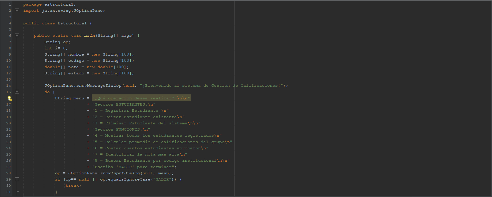
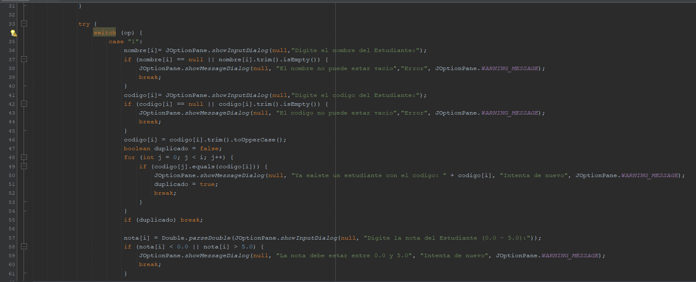
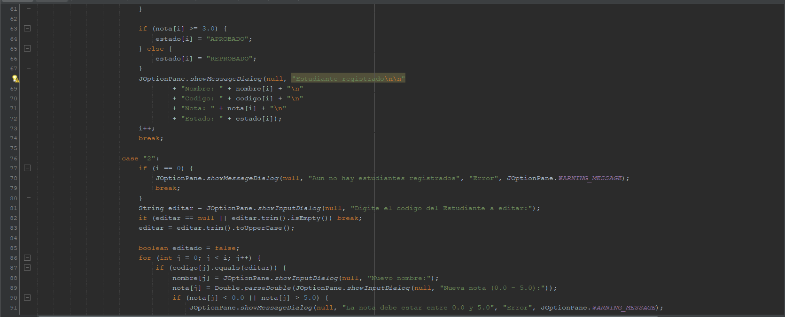
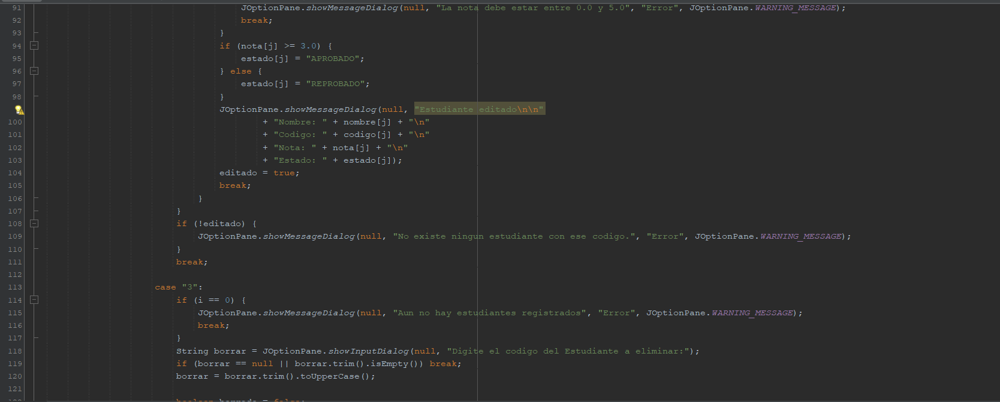
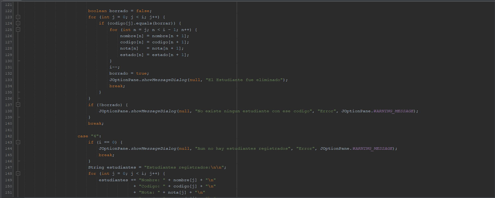
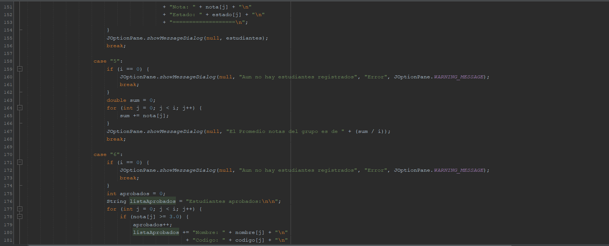
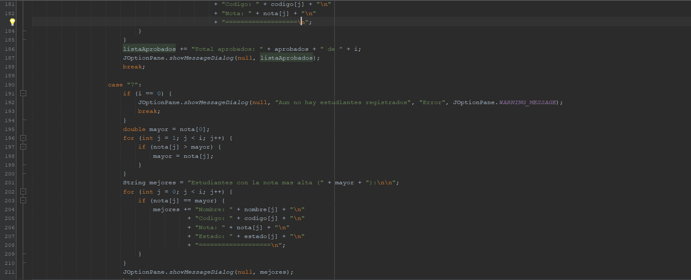
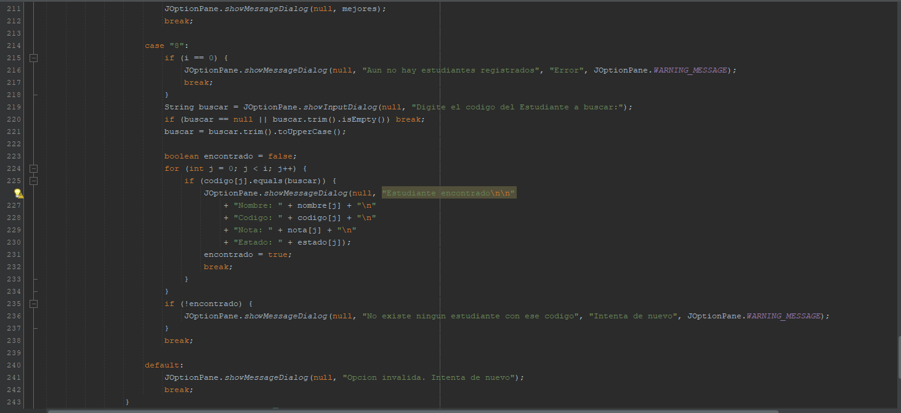

# Sistema de Gestión de Estudiantes - Estructura de Datos

Este proyecto es una aplicación desarrollada en **Java** para la gestión de registros académicos, permitiendo un control dinámico de la información.

### 📂 Ubicación del Código
El código fuente principal con toda la lógica del programa se encuentra en la siguiente ruta:
`src > estructura1 > Estructura1.java`

### 🛠️ Detalles de la Implementación
*   **Funciones de Registro:** Permite ingresar nuevos estudiantes validando que el código sea único.
*   **Funciones de Edición:** Facilita la modificación de datos ya existentes en los arreglos.
*   **Funciones de Borrado:** Permite eliminar registros específicos del sistema.
*   **Interfaz Gráfica:** Se utilizó la clase `JOptionPane` para interactuar mediante ventanas emergentes, logrando una experiencia más limpia y profesional que la consola estándar.
*   **Lógica de Validación:** El programa asegura que las notas estén en el rango de 0.0 a 5.0 e impide la duplicidad de códigos institucionales.
*   **Automatización:** El "Estado de Aprobación" se genera automáticamente según la nota ingresada, optimizando el proceso de carga de datos.

> **Nota para el profesor:** He decidido subir el proyecto completo a este repositorio de GitHub para garantizar la visualización del código con total claridad y evitar la saturación del documento de entrega con capturas de pantalla.

---

## 💻 Capturas del Código Fuente

A continuación se muestra el código completo del sistema desarrollado en Java, dividido en secciones para facilitar su lectura:

### Captura / Pantallazo 1:

### Captura / Pantallazo 2:

### Captura / Pantallazo 3:

### Captura / Pantallazo 4:

### Captura / Pantallazo 5:

### Captura / Pantallazo 6:

### Captura / Pantallazo 7:

### Captura / Pantallazo 8:

---
**Desarrollado por:** Victor Cordoba  
**Carrera:** Ingenieria Informatica
**Materia:** Estructuras de Datos  
**Institución:** Corporación Universitaria Lasallista
